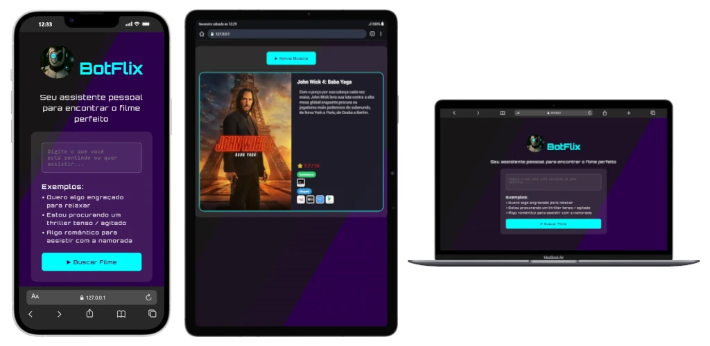

# 🤖 BotFlix - Seu Assistente Pessoal de Filmes

O **BotFlix** é uma aplicação web moderna e intuitiva projetada para ajudar você a encontrar o filme perfeito com base no seu momento. Através de uma interface futurista, você descreve como está se sentindo ou o que deseja assistir, e o nosso assistente robô faz o resto!

[](https://projeto-botflix.vercel.app/)
Para abrir o link em uma nova aba, utilize **Ctrl + Clique** (Windows) ou **Cmd + Clique** (Mac).

---

## 🧐 Sobre o Projeto

Muitas vezes perdemos mais tempo escolhendo o que assistir do que assistindo de fato. O BotFlix resolve esse "problema de escolha" utilizando IA para interpretar o seu humor ou contexto e sugerir um título que combine exatamente com o que você procura.

O projeto foca em uma experiência de usuário (UX) fluida, com transições animadas e uma estética inspirada em interfaces de ficção científica (Sci-Fi), utilizando tons escuros e luzes neon (azuis e ciano).

---

## ✨ Funcionalidades Principais

- **Busca por Contexto/Humor:** Em vez de categorias genéricas, você pode digitar frases como "Quero algo para chorar" ou "Um filme de ação para ver com amigos".
- **Recomendações Detalhadas:** Exibe o pôster oficial, título, sinopse e nota de avaliação (⭐).
- **Onde Assistir:** Integração que mostra em quais plataformas de streaming o filme está disponível (Netflix, Prime Video, Disney+, etc.), categorizados por Assinatura, Aluguel ou Compra.
- **Interface Responsiva:** Design totalmente adaptável para dispositivos móveis, tablets e desktops.
- **Feedback Visual:** Animações de carregamento e transições suaves entre a tela de busca e os resultados.
- **Alertas Customizados:** Sistema de mensagens nativo para orientar o usuário sem interromper a estética do site.

---

## 🛠️ Tecnologias e Métodos

O projeto foi desenvolvido focando em performance e código limpo, utilizando:

- **HTML5 Semântico:** Para melhor acessibilidade e SEO.
- **CSS3 Avançado:**
    - Uso de **Variáveis CSS** para fácil manutenção de cores e estilos.
    - **Flexbox e Grid** para layouts complexos e responsivos.
    - **Keyframes Animations** para transições de interface e efeitos de fundo dinâmico.
- **JavaScript Moderno (ES6+):**
    - **Módulos (ES Modules):** Organização do código em arquivos separados (`api.js`, `ui.js`, `main.js`) para maior escalabilidade.
    - **Fetch API:** Para comunicação assíncrona com o servidor.
    - **Manipulação de DOM:** Atualização dinâmica da interface sem recarregar a página.
- **n8n (Automação de Workflow):** Orquestrador que recebe o texto do usuário, consulta a IA **Gemini** para interpretar a intenção, busca as informações do filme na **API do TMDB** e realiza uma nova requisição (via ID do filme) para identificar onde ele está disponível para assistir, devolvendo os dados completos para o frontend.

---

## 🌐 Arquitetura da Aplicação

A aplicação utiliza uma arquitetura baseada em microserviços e webhooks:

1.  **Frontend:** Coleta o "prompt" (texto) do usuário.
2.  **Integração (n8n):** O frontend dispara uma requisição `POST` para um webhook hospedado no **n8n.cloud**.
3.  **Processamento:** O n8n processa a solicitação ( integrando o modelo de IA **Google Gemini** e a API do **TMDB - The Movie Database**).
4.  **Resposta:** O backend retorna um objeto JSON contendo todos os dados do filme e informações de onde assistir (Watch Providers).

---

## 🚀 Como Executar

Como este é um projeto front-end estático, você não precisa instalar dependências complexas.

1.  **Clone o repositório:**
    ```bash
    git clone https://github.com/seu-usuario/projeto-botflix.git
    ```
2.  **Acesse a pasta do projeto:**
    ```bash
    cd projeto-botflix
    ```
3.  **Abra o projeto:**
    - Basta abrir o arquivo `index.html` em qualquer navegador moderno.
    - **Dica:** Se estiver usando o VS Code, utilize a extensão **Live Server** para uma experiência de desenvolvimento em tempo real.

---

Desenvolvido por Alexmacol 🚀
